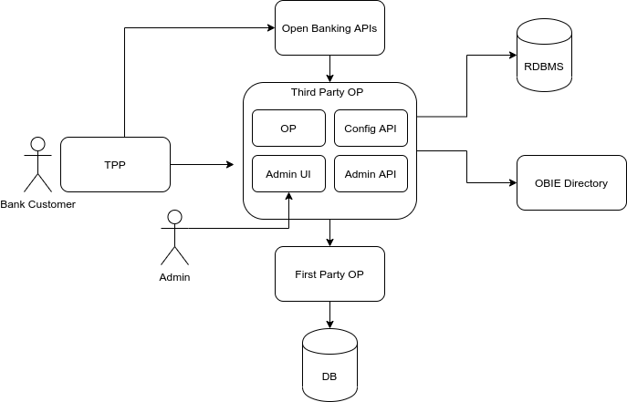

# Gluu Server Open Banking Distribution

## Overview

The Gluu Server Open Banking Distribution is a specific profile of the [Gluu Server](https://gluu.org/docs/gluu-server) that is packaged and configured for Open Banking customers. 

The Gluu Server is a distribution of open source software for identity and access management (IAM). SaaS, custom, open source and commercial web and mobile applications can leverage a Gluu Server for user authentication, identity information, and policy decisions. 

## Components

- Janssen Auth Server
- Janssen Config API
- Gluu Web Admin UI API
- Gluu Web Admin GUI

## Architecture

## Support
Gluu offers free and VIP support! Anyone can browse or register and post questions on the [Gluu support portal](https://support.gluu.org). Tickets opened by the community are public, and we do our best to answer them in a timely manner. 

Private support, guaranteed response times and consultative support are available with a paid support contract. For more information, see [our website](https://gluu.org/pricing).

## Contribute 
We want to keep improving our docs. Please help us improve by submitting any improvements to our [Documentation Github](https://github.com/GluuFederation/docs-open-banking-prod). If you're a Github pro, submit a pull request. If not, just open an issue on any typos, bugs, or improvements you'd like to see addressed. We need your help... even if you're not a coder, you can contribute! 

## License
The Gluu Server is a container distribution of software written by Gluu and incorporated from other open source projects. Gluu projects are frequently prefixed with our open source handle: **ox** (e.g. oxAuth, oxTrust).

The license for each software component included in the container is listed below.

|	Component	|	License	            |
|-----------------------|---------------|
|	Janssen Auth server      | [Apache2](http://www.apache.org/licenses/LICENSE-2.0)|
|	Janssen Config API      | [Apache2](http://www.apache.org/licenses/LICENSE-2.0)|
| Gluu Web Admin UI API | [Apache2](http://www.apache.org/licenses/LICENSE-2.0) |
| Gluu Web Admin UI | [Apache2](http://www.apache.org/licenses/LICENSE-2.0) |
